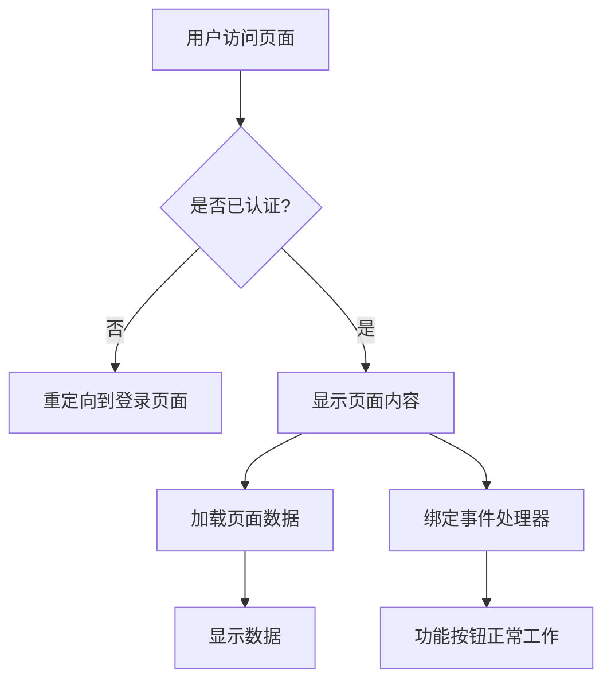
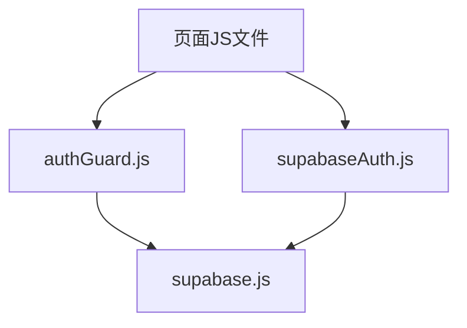
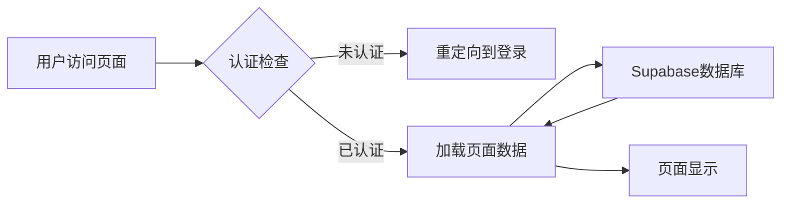

# 设计文档 - 登录模块修改

## 整体架构图

## 分层设计和核心组件

### 认证层
- [authGuard.js](file:///Users/ai/00000/js/authGuard.js) - 认证保护中间件
- [supabaseAuth.js](file:///Users/ai/00000/js/supabaseAuth.js) - Supabase认证服务
- [supabase.js](file:///Users/ai/00000/js/supabase.js) - Supabase客户端配置

### 页面层
- [tasks.js](file:///Users/ai/00000/js/tasks.js) - 任务计划页面
- [schedule.js](file:///Users/ai/00000/js/schedule.js) - 工作排班页面
- [food.js](file:///Users/ai/00000/js/food.js) - 买菜页面
- [stats.js](file:///Users/ai/00000/js/stats.js) - 数据统计页面

## 模块依赖关系图

## 接口契约定义

### authGuard.js 接口
- `checkAuth()` - 检查用户是否已认证
- `requireAuth(redirectUrl)` - 要求用户必须认证才能访问
- `getCurrentUser()` - 获取当前用户
- `clearAuth()` - 清除认证信息

## 数据流向图

## 异常处理策略

1. 未认证访问：重定向到登录页面
2. 认证失败：显示错误消息
3. 数据加载失败：显示错误消息并提供重试选项
4. 网络错误：显示错误消息并提供重试选项