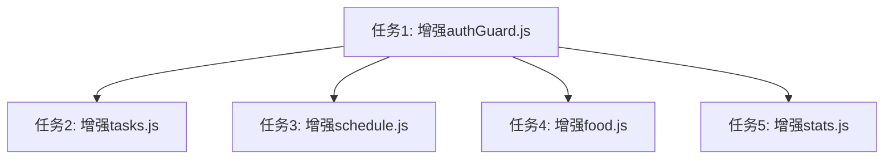

# 任务分解文档 - 登录模块修改

## 原子任务拆分

### 任务1: 检查和增强authGuard.js认证保护中间件
- 输入契约: 
  - 前置依赖: Supabase配置正确
  - 输入数据: 无
  - 环境依赖: 浏览器环境
- 输出契约:
  - 输出数据: 增强的认证保护功能
  - 交付物: 修改后的 [authGuard.js](file:///Users/ai/00000/js/authGuard.js) 文件
  - 验收标准: 认证检查功能完善，能正确识别认证状态
- 实现约束:
  - 技术栈: JavaScript (ES6+)
  - 接口规范: 保持现有接口不变
  - 质量要求: 代码清晰，错误处理完善
- 依赖关系:
  - 后置任务: 所有页面的认证检查增强

### 任务2: 检查和增强tasks.js任务计划页面认证
- 输入契约:
  - 前置依赖: [authGuard.js](file:///Users/ai/00000/js/authGuard.js) 功能完善
  - 输入数据: 无
  - 环境依赖: 浏览器环境
- 输出契约:
  - 输出数据: 增强的认证检查功能
  - 交付物: 修改后的 [tasks.js](file:///Users/ai/00000/js/tasks.js) 文件
  - 验收标准: 未认证用户访问时重定向到登录页面，认证用户能正常使用所有功能
- 实现约束:
  - 技术栈: JavaScript (ES6+)
  - 接口规范: 使用 [authGuard.js](file:///Users/ai/00000/js/authGuard.js) 提供的接口
  - 质量要求: 代码清晰，错误处理完善
- 依赖关系:
  - 前置任务: 任务1
  - 后置任务: 无

### 任务3: 检查和增强schedule.js工作排班页面认证
- 输入契约:
  - 前置依赖: [authGuard.js](file:///Users/ai/00000/js/authGuard.js) 功能完善
  - 输入数据: 无
  - 环境依赖: 浏览器环境
- 输出契约:
  - 输出数据: 增强的认证检查功能
  - 交付物: 修改后的 [schedule.js](file:///Users/ai/00000/js/schedule.js) 文件
  - 验收标准: 未认证用户访问时重定向到登录页面，认证用户能正常使用所有功能
- 实现约束:
  - 技术栈: JavaScript (ES6+)
  - 接口规范: 使用 [authGuard.js](file:///Users/ai/00000/js/authGuard.js) 提供的接口
  - 质量要求: 代码清晰，错误处理完善
- 依赖关系:
  - 前置任务: 任务1
  - 后置任务: 无

### 任务4: 检查和增强food.js买菜页面认证
- 输入契约:
  - 前置依赖: [authGuard.js](file:///Users/ai/00000/js/authGuard.js) 功能完善
  - 输入数据: 无
  - 环境依赖: 浏览器环境
- 输出契约:
  - 输出数据: 增强的认证检查功能
  - 交付物: 修改后的 [food.js](file:///Users/ai/00000/js/food.js) 文件
  - 验收标准: 未认证用户访问时重定向到登录页面，认证用户能正常使用所有功能
- 实现约束:
  - 技术栈: JavaScript (ES6+)
  - 接口规范: 使用 [authGuard.js](file:///Users/ai/00000/js/authGuard.js) 提供的接口
  - 质量要求: 代码清晰，错误处理完善
- 依赖关系:
  - 前置任务: 任务1
  - 后置任务: 无

### 任务5: 检查和增强stats.js数据统计页面认证
- 输入契约:
  - 前置依赖: [authGuard.js](file:///Users/ai/00000/js/authGuard.js) 功能完善
  - 输入数据: 无
  - 环境依赖: 浏览器环境
- 输出契约:
  - 输出数据: 增强的认证检查功能
  - 交付物: 修改后的 [stats.js](file:///Users/ai/00000/js/stats.js) 文件
  - 验收标准: 未认证用户访问时重定向到登录页面，认证用户能正常使用所有功能
- 实现约束:
  - 技术栈: JavaScript (ES6+)
  - 接口规范: 使用 [authGuard.js](file:///Users/ai/00000/js/authGuard.js) 提供的接口
  - 质量要求: 代码清晰，错误处理完善
- 依赖关系:
  - 前置任务: 任务1
  - 后置任务: 无

## 任务依赖图

