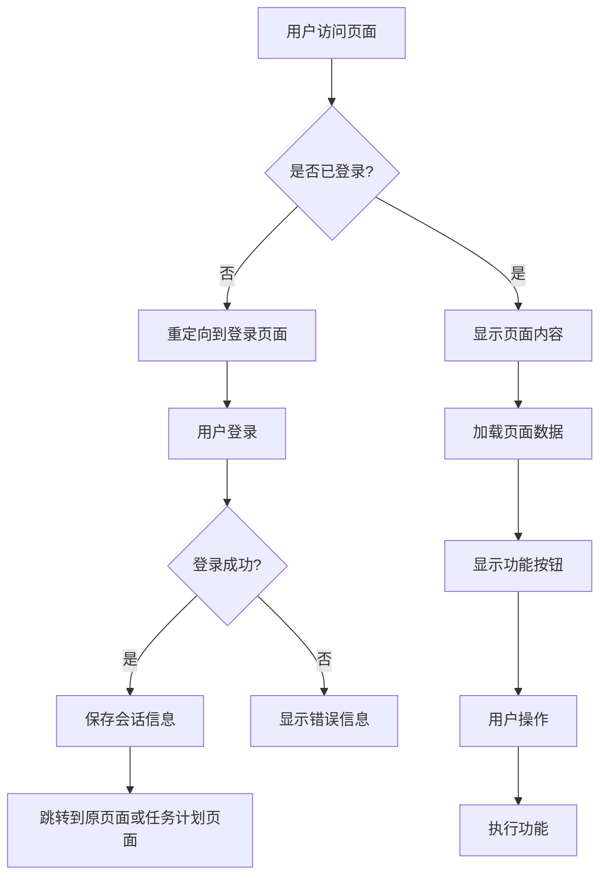

# 登录模块修改任务共识文档

## 明确的需求描述和验收标准

### 需求描述
1. 所有页面都需要登录后才能展示
2. 跳转到任务计划页面后，所有按钮功能都要正常
3. 页面数据都要正常读取

### 验收标准
1. 未登录用户访问任何页面都会自动跳转到登录页面
2. 登录成功后能正确跳转到任务计划页面
3. 任务计划页面的所有功能按钮正常工作
4. 页面数据能正常从Supabase数据库读取和显示

## 技术实现方案

### 技术约束和集成方案
1. 使用Supabase Auth进行用户认证
2. 在每个受保护页面添加认证检查
3. 改进会话管理机制，确保用户状态正确保持
4. 添加全局认证状态监听器，实时更新用户状态

### 任务边界限制
- 仅修改认证相关代码
- 不修改数据库结构
- 不修改UI界面设计

## 解决方案设计

### 整体架构

### 核心组件
1. **认证检查器** - 检查用户是否已登录
2. **会话管理器** - 管理用户会话状态
3. **页面保护器** - 保护受限制的页面
4. **全局状态监听器** - 监听认证状态变化

### 接口契约
1. `checkAuthStatus()` - 检查用户认证状态
2. `requireAuth()` - 要求用户必须登录
3. `handleAuthStateChange()` - 处理认证状态变化

### 数据流向
用户访问页面 → 认证检查 → (未登录)重定向到登录页面 → 用户登录 → 保存会话 → 跳转回原页面 → 加载数据 → 显示功能

### 异常处理策略
1. 网络异常：显示友好的错误提示，提供重试选项
2. 认证失败：清除本地会话信息，重定向到登录页面
3. 数据加载失败：显示错误信息，提供刷新选项