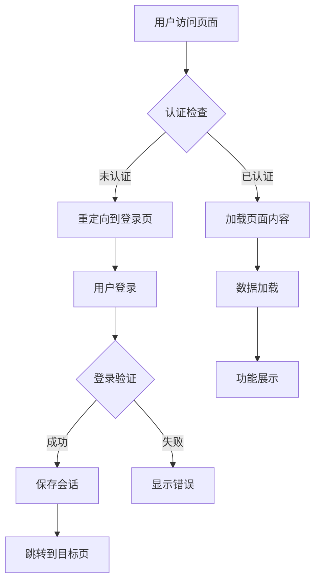
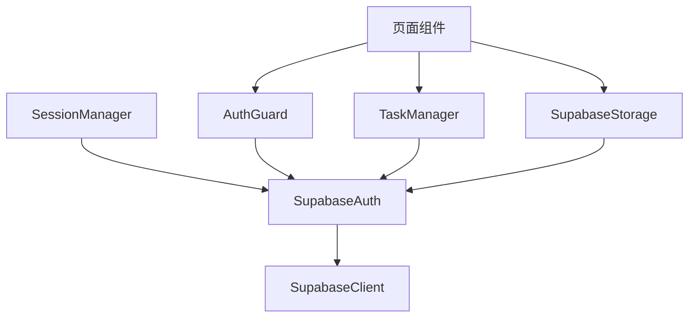
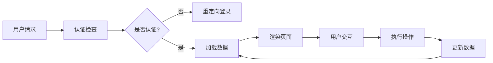

# 登录模块修改任务设计文档

## 整体架构图

## 分层设计和核心组件

### 认证层
- SupabaseAuth类：处理认证逻辑
- SessionManager：管理会话状态
- AuthGuard：页面访问保护

### 业务逻辑层
- TaskManager：任务数据管理
- SupabaseStorage：数据存储访问

### 表示层
- 页面组件：各页面UI展示
- 导航组件：页面间跳转

## 模块依赖关系图

## 接口契约定义

### SupabaseAuth接口
- `signIn(email, password)`: 用户登录
- `signOut()`: 用户登出
- `getCurrentUser()`: 获取当前用户
- `onAuthStateChange(callback)`: 监听认证状态变化

### SessionManager接口
- `saveSession(session)`: 保存会话
- `getSession()`: 获取会话
- `clearSession()`: 清除会话

### AuthGuard接口
- `requireAuth()`: 要求认证访问
- `checkAuth()`: 检查认证状态

## 数据流向图

## 异常处理策略

1. **认证异常**：清除本地会话，重定向到登录页
2. **网络异常**：显示错误提示，提供重试机制
3. **数据异常**：记录错误日志，显示友好提示
4. **会话异常**：自动刷新会话或要求重新登录