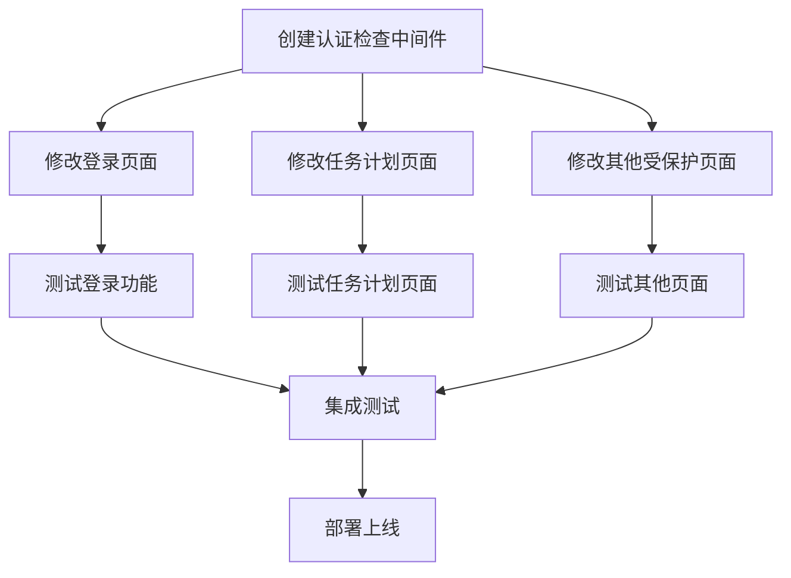

# 登录模块修改任务分解

## 任务依赖图

## 原子任务列表

### 任务1: 创建认证检查中间件
- **输入契约**: 无
- **输出契约**: authGuard.js文件，包含认证检查函数
- **实现约束**: 使用Supabase Auth API，支持重定向功能
- **验收标准**: 能正确检查用户认证状态并重定向未认证用户

### 任务2: 修改登录页面
- **输入契约**: 现有登录页面代码
- **输出契约**: 改进的登录页面，包含更好的错误处理和会话管理
- **实现约束**: 保持现有UI设计，增强认证逻辑
- **验收标准**: 登录成功后能正确跳转，失败时显示适当错误信息

### 任务3: 修改任务计划页面
- **输入契约**: 现有任务计划页面代码
- **输出契约**: 增加认证检查的任务计划页面
- **实现约束**: 在页面加载时检查认证状态
- **验收标准**: 未认证用户无法访问，认证用户能正常使用所有功能

### 任务4: 修改其他受保护页面
- **输入契约**: 现有其他页面代码（schedule.html, food.html, stats.html）
- **输出契约**: 增加认证检查的所有页面
- **实现约束**: 统一认证检查机制
- **验收标准**: 所有页面都要求认证访问

### 任务5: 测试登录功能
- **输入契约**: 修改后的登录页面
- **输出契约**: 测试报告
- **实现约束**: 使用测试账户进行验证
- **验收标准**: 登录功能正常工作，错误处理正确

### 任务6: 测试任务计划页面
- **输入契约**: 修改后的任务计划页面
- **输出契约**: 测试报告
- **实现约束**: 验证所有功能按钮正常工作
- **验收标准**: 页面功能完整，数据读取正常

### 任务7: 测试其他页面
- **输入契约**: 修改后的其他页面
- **输出契约**: 测试报告
- **实现约束**: 验证页面访问控制
- **验收标准**: 未认证用户无法访问，认证用户能正常使用

### 任务8: 集成测试
- **输入契约**: 所有修改后的页面
- **输出契约**: 集成测试报告
- **实现约束**: 端到端测试流程
- **验收标准**: 整体流程顺畅，无安全漏洞

## 任务详细信息

### 任务1: 创建认证检查中间件
- **前置依赖**: Supabase配置正确
- **输入数据**: 无
- **环境依赖**: Supabase JS库
- **输出数据**: authGuard.js文件
- **交付物**: 可复用的认证检查函数
- **验收标准**: 
  1. 能正确检测用户认证状态
  2. 未认证用户被重定向到登录页面
  3. 认证用户可正常访问受保护资源
- **技术栈**: JavaScript, Supabase Auth
- **接口规范**: 提供checkAuth和requireAuth函数
- **质量要求**: 代码简洁，错误处理完善
- **后置任务**: 任务2, 任务3, 任务4
- **并行任务**: 无

### 任务2: 修改登录页面
- **前置依赖**: 任务1完成
- **输入数据**: index.html, simpleAuth.js
- **环境依赖**: authGuard.js
- **输出数据**: 修改后的登录页面文件
- **交付物**: 改进的登录页面
- **验收标准**: 
  1. 登录成功后跳转到正确页面
  2. 登录失败时显示适当错误信息
  3. 会话信息正确保存
- **技术栈**: HTML, JavaScript, Supabase Auth
- **接口规范**: 与SupabaseAuth类集成
- **质量要求**: 用户体验良好，安全性高
- **后置任务**: 任务5
- **并行任务**: 任务3, 任务4

### 任务3: 修改任务计划页面
- **前置依赖**: 任务1完成
- **输入数据**: pages/tasks.html, js/tasks.js
- **环境依赖**: authGuard.js
- **输出数据**: 修改后的任务计划页面文件
- **交付物**: 增加认证检查的任务计划页面
- **验收标准**: 
  1. 未认证用户无法访问页面
  2. 认证用户能正常使用所有功能
  3. 数据能正常加载和显示
- **技术栈**: HTML, JavaScript, Supabase Auth
- **接口规范**: 与AuthGuard集成
- **质量要求**: 功能完整，性能良好
- **后置任务**: 任务6
- **并行任务**: 任务2, 任务4

### 任务4: 修改其他受保护页面
- **前置依赖**: 任务1完成
- **输入数据**: pages/schedule.html, pages/food.html, pages/stats.html及相关JS文件
- **环境依赖**: authGuard.js
- **输出数据**: 修改后的页面文件
- **交付物**: 增加认证检查的所有页面
- **验收标准**: 
  1. 所有页面都要求认证访问
  2. 未认证用户被重定向到登录页面
- **技术栈**: HTML, JavaScript, Supabase Auth
- **接口规范**: 与AuthGuard集成
- **质量要求**: 一致性好，维护性高
- **后置任务**: 任务7
- **并行任务**: 任务2, 任务3

### 任务5: 测试登录功能
- **前置依赖**: 任务2完成
- **输入数据**: 修改后的登录页面
- **环境依赖**: 测试账户
- **输出数据**: 测试报告
- **交付物**: 登录功能测试报告
- **验收标准**: 
  1. 正常登录流程工作正常
  2. 错误处理机制有效
  3. 会话管理正确
- **技术栈**: 手动测试
- **接口规范**: 使用标准测试流程
- **质量要求**: 覆盖所有场景
- **后置任务**: 任务8
- **并行任务**: 任务6, 任务7

### 任务6: 测试任务计划页面
- **前置依赖**: 任务3完成
- **输入数据**: 修改后的任务计划页面
- **环境依赖**: 测试账户，Supabase数据库
- **输出数据**: 测试报告
- **交付物**: 任务计划页面测试报告
- **验收标准**: 
  1. 页面访问控制有效
  2. 所有功能按钮正常工作
  3. 数据加载和显示正确
- **技术栈**: 手动测试
- **接口规范**: 使用标准测试流程
- **质量要求**: 功能测试完整
- **后置任务**: 任务8
- **并行任务**: 任务5, 任务7

### 任务7: 测试其他页面
- **前置依赖**: 任务4完成
- **输入数据**: 修改后的其他页面
- **环境依赖**: 测试账户
- **输出数据**: 测试报告
- **交付物**: 其他页面测试报告
- **验收标准**: 
  1. 页面访问控制有效
  2. 未认证用户无法访问
  3. 认证用户能正常使用
- **技术栈**: 手动测试
- **接口规范**: 使用标准测试流程
- **质量要求**: 覆盖所有页面
- **后置任务**: 任务8
- **并行任务**: 任务5, 任务6

### 任务8: 集成测试
- **前置依赖**: 任务5, 任务6, 任务7完成
- **输入数据**: 所有修改后的页面
- **环境依赖**: 完整的测试环境
- **输出数据**: 集成测试报告
- **交付物**: 集成测试报告
- **验收标准**: 
  1. 整体流程顺畅
  2. 无安全漏洞
  3. 用户体验良好
- **技术栈**: 端到端测试
- **接口规范**: 使用标准测试流程
- **质量要求**: 全面覆盖所有场景
- **后置任务**: 无
- **并行任务**: 无